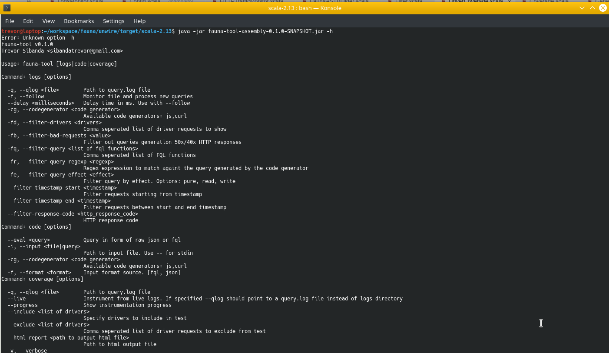

fauna-tool v0.1.0 [![Build Status]][travis-url] [](https://codecov.io/gh/trevorsibanda/fauna-tool)
======================================================================
[Build Status]: https://travis-ci.org/trevorsibanda/fauna-tool.svg
[travis-url]: https://travis-ci.org/trevorsibanda/fauna-tool





fauna-tool is a Scala based program nitially built to only reverse engineer the wire protocol to an easier to read language specific FQL syntax, it also allows monitoring of faunadb log files with the ability to apply filters for narrower searches.

A fuzzer and coverage command feature are also included to generate random queries with specificed constraints and runs driver coverage tests respectively.

## Usage

```bash
fauna-tool -h
```

### Wire Protocol Reverse

```bash
fauna-tool code
```

### Logs Monitor


```bash
fauna-tool logs
```


### Coverage


```bash
fauna-tool coverage
```


### Fuzzer

```bash
fauna-tool fuzz
```


### Query Validator

```bash
fauna-tool validate
```
